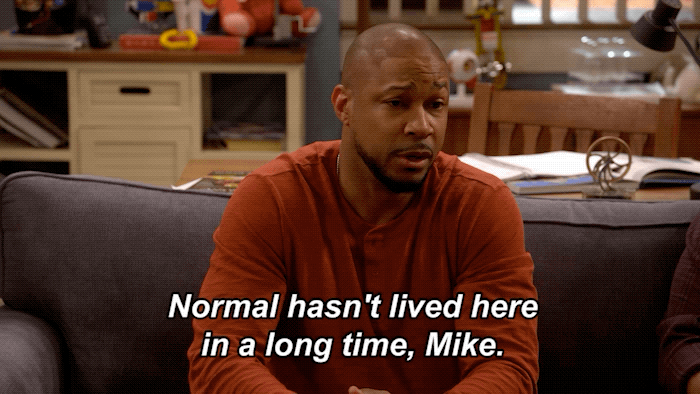

# Will's Blog

### 1. Was your first week what you expected? Why? Why not?
No it wasn't. When I started this I was thinking I was going to get hit with a Titanic load of material the 1st 2 days and be expected to learn it in 3 snaps. My anxiety clocked in on time.

### 2. What are you excited or eager to learn more about? 
JavaScript and Python. Back in 2015-2016 I played a little bit with JavaScript and Python (More Python than JavaScript) so I'll be excited to try to understand those 2 languages a bit better.

### 3. What is something about you that can only be learned by reading this blog?
I'm timid and reserved most times but I'm also a GOOFBALL. Laughing is a thing I enjoy a lot. Comedy is also my favorite genre. Being normal is overrated sometimes.

# Onboard Sprint 2: After Demo Day

### 1. What are your thoughts about the roles HTML, CSS, and JavaScript play in the process of rendering content and providing user experience?
It's very intriguing and still somewhat confusing on how these 3 languages dance together to do what they do. 

### 2. What are your thoughts on pseudocoding?
I was intimidated with it at first because of how important it is. Im not a good writer, but now knowing that I'm writing it to where I can understand the code and writing it to help myself organize the code can only benefit me in the long run. It became less initimidating after that realization.

### 3. What was helpful during Onboarding working remotely?
Honestly being able to take breaks when I started to feel overwhelmed and instructor encouragement.

### 4. What hindered your progress during Onboarding?
Reading and trying to understand the documentation. The reading ends up taking me almost 15-25 minutes to get through one section and have a hope that I understand the gist. Only to get to a practice or a project that we have to do and be nearly completely stumped.

### 5. How did you overcome challenges during Onboarding?
I keep telling myself "You dont know what you dont know", "Do what you can", and "You got this". Reassuing myself only does so much but I keep repeating those things to myself, BREATHE, and then reread what Ive read before. 