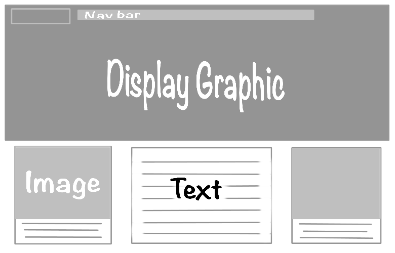
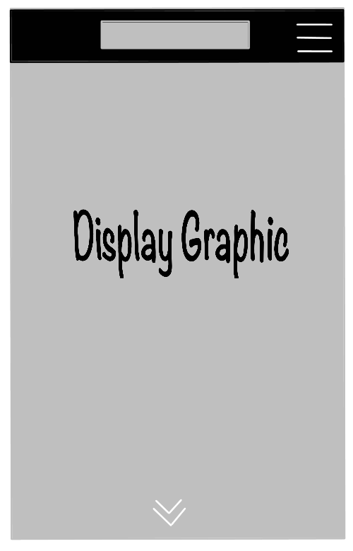
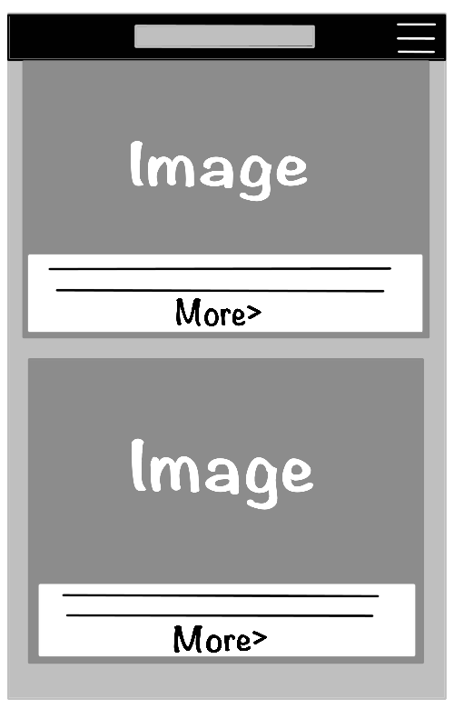

# Blog Layout Idea/Mock-up
### Blog Desktop Layout

* Nav bar at the top (center)
* A display image/graphic that could cpan the width of the page.
* Images on either OR both sides of text area. (*More than likely to just do text area primarily on **Right** and Image area on **left***)
* Under Images would be a "Click here for more" Call to action. 

### Blog Mobile Layout

* A more condensed and simple menu bar at the top with a hamburger menu button that drops down to other nav links.
* Logo/Icon or name of Blog is at top center. (More than likely to just put an icon on the left side for a cleaner minimalist look).
* Display graphic changes to cover entire mobile page.
* Call to action arrow icon at the bottom to signal the user/vsitor to scroll.

* As you scroll down, menu bar stays at the top with the hamburger menu button.
* Image blocks with call to actions arrows to read more on different blog posts.